# MSBM-HRM-Suite — Tech Stack & Directory Tree

## Tech Stack Overview

```mermaid
graph TD
    A["MSBM-HRM-Suite"] --> B["Frontend"]
    A --> C["Backend / API"]
    A --> D["Database"]
    A --> E["DevOps"]
    A --> F["Testing"]

    B --> B1["Next.js 16 (App Router)"]
    B --> B2["React 19"]
    B --> B3["TypeScript 5"]
    B --> B4["Tailwind CSS 4"]
    B --> B5["shadcn/ui (Radix primitives)"]
    B --> B6["Framer Motion"]
    B --> B7["Recharts"]
    B --> B8["Zustand (state)"]
    B --> B9["TanStack Query + Table"]
    B --> B10["Lucide React (icons)"]
    B --> B11["React Hook Form + Zod"]
    B --> B12["Leaflet / React Leaflet"]

    C --> C1["Next.js API Routes"]
    C --> C2["Supabase SSR SDK"]
    C --> C3["Supabase JS Client"]

    D --> D1["Supabase (Postgres)"]
    D --> D2["RLS Policies"]
    D --> D3["Audit Triggers"]
    D --> D4["Feature Flags & Seed Data"]

    E --> E1["Docker"]
    E --> E2["Railway (hosting)"]
    E --> E3["PostCSS"]
    E --> E4["ESLint 9"]
    E --> E5["Sharp (image opt)"]

    F --> F1["Vitest 4"]
    F --> F2["Testing Library (React)"]
    F --> F3["jsdom"]
```



---

## Dependency Breakdown

| Category | Package | Version |
|---|---|---|
| **Framework** | Next.js | ^16.1.1 |
| **UI Library** | React / React DOM | ^19.0.0 |
| **Language** | TypeScript | ^5 |
| **Styling** | Tailwind CSS | ^4 |
| | tailwindcss-animate / tw-animate-css | ^1.0.7 / ^1.3.5 |
| | tailwind-merge | ^3.3.1 |
| **Component System** | Radix UI (20+ primitives) | various |
| | class-variance-authority | ^0.7.1 |
| | cmdk (command palette) | ^1.1.1 |
| | sonner (toasts) | ^2.0.6 |
| | vaul (drawer) | ^1.1.2 |
| | input-otp | ^1.4.2 |
| | embla-carousel-react | ^8.6.0 |
| | react-resizable-panels | ^3.0.3 |
| **Animation** | Framer Motion | ^12.23.2 |
| **Charts** | Recharts | ^2.15.4 |
| **State** | Zustand | ^5.0.6 |
| **Data Fetching** | TanStack React Query | ^5.82.0 |
| **Tables** | TanStack React Table | ^8.21.3 |
| **Forms** | React Hook Form | ^7.60.0 |
| | @hookform/resolvers | ^5.1.1 |
| | Zod | ^4.0.2 |
| **Maps** | Leaflet + React Leaflet | ^1.9.4 / ^5.0.0 |
| **Backend** | @supabase/supabase-js | ^2.103.0 |
| | @supabase/ssr | ^0.10.2 |
| **Dates** | date-fns | ^4.1.0 |
| | react-day-picker | ^9.8.0 |
| **Markdown** | react-markdown | ^10.1.0 |
| | react-syntax-highlighter | ^15.6.1 |
| **Images** | Sharp | ^0.34.3 |
| **Theme** | next-themes | ^0.4.6 |
| **Testing** | Vitest | ^4.1.4 |
| | @testing-library/react | ^16.3.2 |
| | @testing-library/jest-dom | ^6.9.1 |
| | @testing-library/user-event | ^14.6.1 |
| | jsdom | ^29.0.2 |
| **Linting** | ESLint + eslint-config-next | ^9 / ^16.1.1 |
| **Build** | @tailwindcss/postcss | ^4 |
| | @vitejs/plugin-react | ^6.0.1 |

---

## Directory Tree

```
MSBM-HRM-Suite/
├── .dockerignore
├── .env / .env.local / .env.example
├── .gitignore
├── Dockerfile                          # Docker production build
├── railway.toml                        # Railway deployment config
├── package.json
├── package-lock.json
├── tsconfig.json                       # TS — ES2017 target, bundler resolution
├── next.config.ts
├── tailwind.config.ts                  # TW v4, shadcn CSS vars theme
├── postcss.config.mjs
├── eslint.config.mjs
├── vitest.config.ts
├── components.json                     # shadcn/ui component registry
├── README.md
├── msbm_hr_suite_feature_walkthrough.md
├── walkthrough.md
├── worklog.md
├── rebrand.py                          # One-off rebrand migration script
│
├── public/
│   ├── MSBM-icon.png
│   ├── logo.svg
│   └── robots.txt
│
├── supabase/
│   └── migrations/
│       ├── 001_initial_schema.sql      # Core DB schema
│       ├── 002_rls_policies.sql        # Row Level Security
│       ├── 003_audit_triggers.sql      # Audit trail triggers
│       └── 004_feature_flags_and_seed.sql
│
└── src/
    ├── proxy.ts                        # API proxy utility
    │
    ├── app/                            # ─── Next.js App Router ───
    │   ├── globals.css                 # Master stylesheet (165 KB, design tokens)
    │   ├── layout.tsx                  # Root layout (providers, fonts)
    │   ├── page.tsx                    # Main dashboard SPA shell
    │   │
    │   ├── login/
    │   │   └── page.tsx                # Auth / login page
    │   │
    │   └── api/                        # ─── API Route Handlers ───
    │       ├── route.ts                # Root health check
    │       ├── activity-feed/
    │       ├── ai-chat/
    │       ├── announcements/
    │       ├── attendance/
    │       ├── auth/
    │       ├── compliance/
    │       ├── department-roles/
    │       ├── departments/
    │       ├── employees/
    │       ├── geofences/
    │       ├── jobs/
    │       ├── messages/
    │       ├── notifications/
    │       ├── payroll/
    │       ├── performance-reviews/
    │       ├── pto/
    │       ├── pto-balances/
    │       ├── scheduling/
    │       ├── seed/
    │       ├── settings/
    │       ├── shifts/
    │       └── time-entries/
    │
    ├── components/
    │   ├── ui/                         # ─── shadcn/ui Primitives (49) ───
    │   │   ├── accordion.tsx
    │   │   ├── alert-dialog.tsx
    │   │   ├── alert.tsx
    │   │   ├── api-state.tsx
    │   │   ├── aspect-ratio.tsx
    │   │   ├── avatar.tsx
    │   │   ├── badge.tsx
    │   │   ├── breadcrumb.tsx
    │   │   ├── button.tsx
    │   │   ├── calendar.tsx
    │   │   ├── card.tsx
    │   │   ├── carousel.tsx
    │   │   ├── chart.tsx
    │   │   ├── checkbox.tsx
    │   │   ├── collapsible.tsx
    │   │   ├── command.tsx
    │   │   ├── context-menu.tsx
    │   │   ├── dialog.tsx
    │   │   ├── drawer.tsx
    │   │   ├── dropdown-menu.tsx
    │   │   ├── form.tsx
    │   │   ├── hover-card.tsx
    │   │   ├── input-otp.tsx
    │   │   ├── input.tsx
    │   │   ├── label.tsx
    │   │   ├── menubar.tsx
    │   │   ├── navigation-menu.tsx
    │   │   ├── pagination.tsx
    │   │   ├── popover.tsx
    │   │   ├── progress.tsx
    │   │   ├── radio-group.tsx
    │   │   ├── resizable.tsx
    │   │   ├── scroll-area.tsx
    │   │   ├── select.tsx
    │   │   ├── separator.tsx
    │   │   ├── sheet.tsx
    │   │   ├── sidebar.tsx
    │   │   ├── skeleton.tsx
    │   │   ├── slider.tsx
    │   │   ├── sonner.tsx
    │   │   ├── switch.tsx
    │   │   ├── table.tsx
    │   │   ├── tabs.tsx
    │   │   ├── textarea.tsx
    │   │   ├── toast.tsx
    │   │   ├── toaster.tsx
    │   │   ├── toggle-group.tsx
    │   │   ├── toggle.tsx
    │   │   └── tooltip.tsx
    │   │
    │   └── hrm/                        # ─── HRM Feature Views (34) ───
    │       ├── ai-chat-view.tsx
    │       ├── announcements-view.tsx
    │       ├── attendance-view.tsx
    │       ├── benefits-view.tsx
    │       ├── compliance-view.tsx
    │       ├── dashboard-view.tsx
    │       ├── department-roles-view.tsx
    │       ├── documents-view.tsx
    │       ├── employee-directory-view.tsx
    │       ├── employee-profile-editor.tsx
    │       ├── employees-view.tsx
    │       ├── expense-view.tsx
    │       ├── feedback-view.tsx
    │       ├── geofence-view.tsx
    │       ├── goals-view.tsx
    │       ├── ja-compliance-view.tsx
    │       ├── kudos-view.tsx
    │       ├── meeting-rooms-view.tsx
    │       ├── my-documents-view.tsx
    │       ├── onboarding-view.tsx
    │       ├── payroll-view.tsx
    │       ├── performance-reviews-view.tsx
    │       ├── pto-view.tsx
    │       ├── recruitment-view.tsx
    │       ├── reports-view.tsx
    │       ├── settings-view.tsx
    │       ├── shifts-view.tsx
    │       ├── smart-scheduling-view.tsx
    │       ├── team-analytics-view.tsx
    │       ├── team-hub-view.tsx
    │       ├── time-tracking-view.tsx
    │       ├── training-view.tsx
    │       ├── wellness-view.tsx
    │       └── workforce-reports-view.tsx
    │
    ├── hooks/
    │   ├── use-api.ts                  # Generic API fetch hook
    │   ├── use-mobile.ts              # Mobile breakpoint detection
    │   └── use-toast.ts               # Toast notification hook
    │
    ├── lib/
    │   ├── utils.ts                   # clsx / cn utility
    │   ├── export.ts                  # CSV / data export helpers
    │   ├── geo.ts                     # Geofencing calculations
    │   ├── payroll.ts                 # Payroll computation engine
    │   ├── permissions.ts             # RBAC permission system
    │   ├── supabase/
    │   │   ├── client.ts              # Browser Supabase client
    │   │   ├── server.ts              # Server-side Supabase client
    │   │   └── middleware.ts          # Auth middleware
    │   └── validation/
    │       ├── employee.ts            # Employee data schemas
    │       └── scheduling.ts          # Scheduling data schemas
    │
    ├── store/
    │   └── app.ts                     # Zustand global app store
    │
    ├── types/
    │   └── supabase.ts                # Supabase DB type definitions (90 KB)
    │
    ├── test/
    │   └── setup.ts                   # Vitest global test setup + mocks
    │
    └── __tests__/
        ├── components/                # ─── Component Tests (10) ───
        │   ├── ai-chat-view.test.tsx
        │   ├── benefits-view.test.tsx
        │   ├── dashboard-view.test.tsx
        │   ├── expense-view.test.tsx
        │   ├── page.test.tsx
        │   ├── performance-reviews-view.test.tsx
        │   ├── shifts-view.test.tsx
        │   ├── team-analytics-view.test.tsx
        │   ├── training-view.test.tsx
        │   └── workforce-reports-view.test.tsx
        │
        ├── integration/               # ─── Integration Tests (2) ───
        │   ├── auth-flow.test.tsx
        │   └── role-based-access.test.tsx
        │
        └── unit/                      # ─── Unit Tests (3) ───
            ├── export.test.ts
            ├── payroll.test.ts
            └── store.test.ts
```

---

## Architecture Summary

```mermaid
graph LR
    subgraph Client["Browser (React 19)"]
        SPA["SPA Shell (page.tsx)"]
        Views["34 HRM Feature Views"]
        UI["49 shadcn/ui Primitives"]
        Store["Zustand Store"]
        RQ["TanStack Query Cache"]
    end

    subgraph Server["Next.js 16 Server"]
        API["22 API Route Handlers"]
        MW["Supabase Auth Middleware"]
        RBAC["Permission Engine"]
    end

    subgraph DB["Supabase (Postgres)"]
        Tables["Schema + Migrations"]
        RLS["Row Level Security"]
        Audit["Audit Triggers"]
    end

    SPA --> Views
    Views --> UI
    Views --> Store
    Views --> RQ
    RQ -->|fetch| API
    API --> MW
    MW --> RBAC
    API -->|@supabase/ssr| DB
```

| Metric | Count |
|---|---|
| HRM Feature Modules | 34 |
| shadcn/ui Components | 49 |
| API Route Domains | 22 |
| Custom Hooks | 3 |
| Library Utilities | 7 files |
| DB Migrations | 4 |
| Test Files | 15 |
| Total Dependencies | 49 prod + 11 dev |
